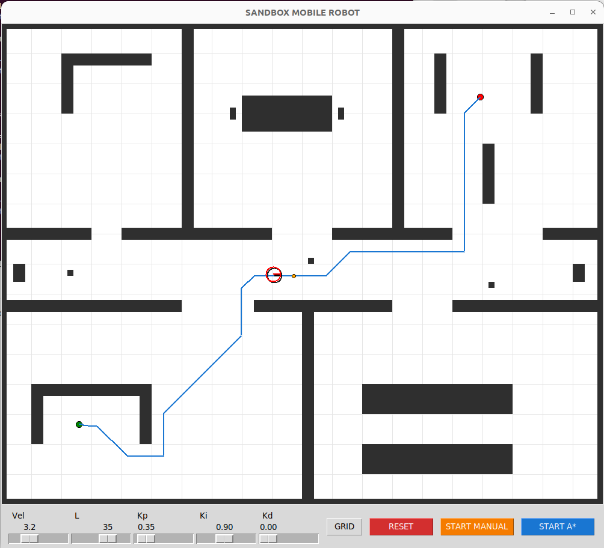

# Autonomous Mobile Robot Sandbox

A high-fidelity 2D simulation environment for a differential-drive robot, integrating global path planning, sensor fusion, and geometric motion control. This project demonstrates the implementation of a full autonomy stack, from high-level A* planning to low-level PID motor control.

---
||
## 1. System Architecture & Dependencies

The project is built using a modular object-oriented approach in **Python 3.x**. It minimizes external dependencies to ensure portability and performance.

### Core Dependencies
* **NumPy**: Used for linear algebra (EKF matrix operations) and sensor noise modeling.
* **Tkinter**: Handles the GUI and the 30Hz simulation loop.
* **SciPy (Optional)**: Used for `CubicSpline` interpolation to generate smooth trajectories from discrete grid points.
* **Math**: Standard library for trigonometric and geometric computations.

### Module Breakdown
* `main.py`: Orchestrates the simulation, GUI events, and the synchronization between the EKF and the controllers.
* `environment.py`: Implements the occupancy grid, obstacle inflation, and neighbor search logic.
* `robot.py`: Simulates the "True" physics of the robot, including motor dynamics and sensor error models.
* `kalman.py`: The estimation engine (EKF).
* `pathFinding.py`: Global planner (A*) and trajectory sampling.
* `control.py`: Implements PID control and pure pursuit control.

---

## 2. Extended Kalman Filter (EKF) Theory

The robot operates in a "stochastic" environment where sensors are imperfect. The EKF is used to estimate the state of the robot by fusing wheel encoders and an IMU (gyroscope).

### State Vector & Motion Model
The state vector $X$ is defined as:
$$X = \begin{bmatrix} x & y & \theta & \omega & \beta \end{bmatrix}^T$$
* $(x, y)$: Cartesian position.
* $\theta$: Heading angle (orientation).
* $\omega$: True angular velocity.
* $\beta$: Gyroscope bias (random walk).

The **Prediction Step** uses a nonlinear unicycle motion model to propagate the state forward in time based on the previous state and commanded velocities:
$$x_{k+1} = x_k + v \cos(\theta) \Delta t$$
$$y_{k+1} = y_k + v \sin(\theta) \Delta t$$
$$\theta_{k+1} = \theta_k + \omega \Delta t$$

### Sensor Fusion & Correction
The EKF handles two different measurement updates to correct the prediction:
1.  **Encoder Update**: Measures $\omega$ based on the difference in wheel speeds.
2.  **IMU Update**: Measures the sum of angular velocity and bias ($z = \omega + \beta + \nu$).

**Observability Choice**: By including the bias $\beta$ in the state vector, the EKF makes the gyroscope drift observable. Over time, the filter learns the bias, allowing for precise heading estimation even when the IMU is noisy.

---

## 3. Path Planning & Navigation

### Global Planner: A* Search
The navigation starts by finding the shortest path on a discrete 8-connected grid.
* **Octile Heuristic**: Used to accurately account for the cost of diagonal moves ($1$ vs $\sqrt{2}$).
* **Obstacle Inflation**: Obstacles are expanded in `environment.py` by an `inflateValue`. This ensures that the robot (which has a physical radius) can be treated as a point during planning without hitting walls.

### Local Controller: Pure Pursuit
Pure Pursuit is a geometric controller that calculates the steering command required to follow a path.

* **Lookahead ($L$)**: The robot looks for a target point on the path at distance $L$.
* **Curvature ($\kappa$)**: The algorithm computes a circular arc to that point using:
    $$\kappa = \frac{2 \Delta y}{L^2}$$
    where $\Delta y$ is the lateral error in the robot's local frame.
* **Velocity**: The angular velocity is commanded as $\omega = v \cdot \kappa$.

---

## 4. Low-Level Motor Control

The `Robot` class does not move instantaneously. It simulates internal motor dynamics using a **State-Space Model**.
* **PID Control**: Each wheel (Left/Right) has a dedicated PID controller that minimizes the error between the "target" wheel speed (from Pure Pursuit) and the "actual" wheel speed.
* **Dynamics**: The motor state propagates as $x[k+1] = A x[k] + B u[k]$, simulating inertia and physical response time.

---

## 5. How to Run
1. Ensure `numpy` and `scipy` are installed.
2. Execute `python main.py`.
3. **Left-Click**: Set Start (Green).
4. **Left-Click**: Set Goal (Red).
5. **Start A***: Autonomous tracking using EKF and Pure Pursuit.
6. **Start Manual**: Control with WASD to test EKF bias estimation in real-time.