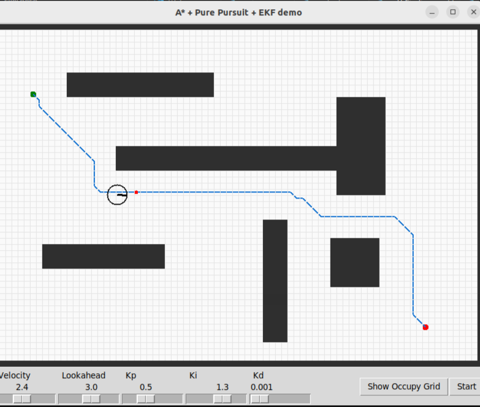

# Robotics Sandbox Project

This project is a **simulation sandbox** for experimenting with several aspects of **mobile robotics**, including:

* **Pathfinding algorithms**: currently A\* (with both 4- and 8-connectivity), with plans to integrate **RRT**\* in the near future.
* **Trajectory resampling** via cubic splines and constant-velocity rollout.
* **Path tracking** using the **Pure Pursuit controller**.
* **State estimation** using an **Extended Kalman Filter (EKF)**.
* **Motor modeling** with internal PID controllers and noisy measurements.
* **Environment modeling** as a 2D occupancy grid with inflation (safety margin).

The goal is to provide a modular framework where algorithms can be tested together in a controlled environment.

---
| |
|:--:|
||
## Project Structure

* `environment.py` → Grid-based world, obstacles, inflated occupancy grid, and drawing utilities.
* `astar.py` → A\* pathfinding algorithm, Manhattan and Octile heuristics, spline rollout for trajectory.
* `control.py` → Pure Pursuit controller and generic PID controller.
* `robot.py` → Differential-drive robot model with two independent motors and PID.
* `kalman.py` → Extended Kalman Filter (EKF) for state estimation.
* `main.py` → Tkinter-based simulation frontend with GUI, sliders, and buttons.

---

## How to Run

1. Install required dependencies:

   ```bash
   pip install numpy sympy scipy
   ```

2. Run the simulator:

   ```bash
   python3 main.py
   ```

3. A Tkinter window will open with a grid environment.

---

## How to Use the Simulator

### Mouse Interaction

* **Left-click** once on the grid → set the **Start position** (green dot).
* **Left-click** again → set the **Goal position** (red dot).

### Buttons

* **Start** → Runs A\* pathfinding, computes a trajectory, and starts the simulation with EKF + Pure Pursuit.
* **Show Occupy Grid** → Toggles between displaying the raw and inflated occupancy grid.

### Sliders

* **Velocity** → Sets the desired forward velocity of the robot.
* **Lookahead** → Adjusts the lookahead distance for the Pure Pursuit controller.
* **Kp, Ki, Kd** → Tune the PID gains for the motor controllers in real time.

---

## Simulation Flow

1. **Path Planning**

   * A\* computes a path from Start to Goal.
   * Path is resampled into a smooth trajectory with constant velocity.

2. **Control**

   * Pure Pursuit computes velocity and angular velocity commands based on the current lookahead point.
   * Commands are passed to the robot's left and right motors.

3. **Robot Dynamics**

   * Motors simulate noisy actuation with embedded PID.
   * Robot pose is updated in the grid world.

4. **State Estimation (EKF)**

   * Robot measurements: noisy GPS (x, y) and wheel velocities.
   * EKF fuses motion model and measurements to produce a state estimate (x, y, θ, vL, vR).
   * Pure Pursuit and arrival check use **estimated states** instead of ground truth.

5. **Visualization**

   * Start, Goal, and planned path are drawn.
   * The robot (circle + heading line) updates in real time.
   * Lookahead point is displayed as a red dot.

---

## Future Extensions

* Add **RRT**\* for faster, sampling-based path planning.
* Integrate **different controllers** (Stanley, LQR, MPC).
* Improve noise models for sensors and motors.
* Add more realistic sensors (e.g., LiDAR-like exploration).

---

## Notes

* Units are expressed in **grid cells** for simplicity, but the system can be adapted to metric units.
* The simulator is designed for **educational and research purposes** to test algorithms in a sandbox environment.
